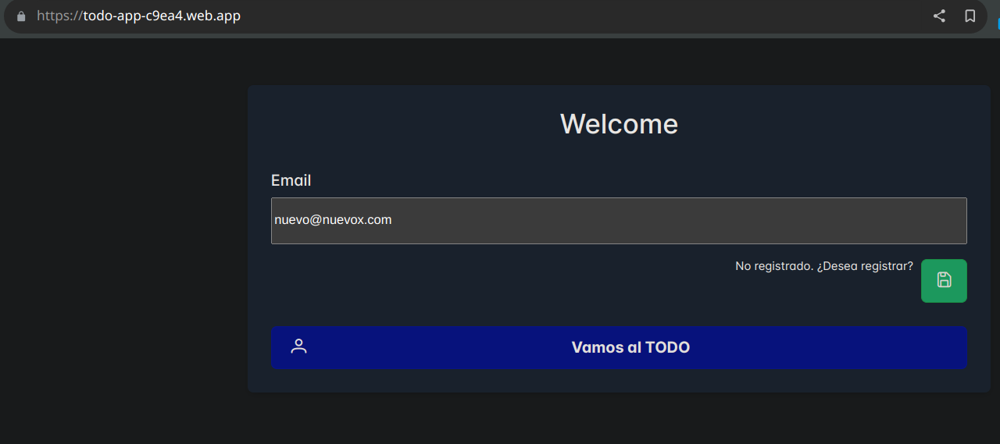
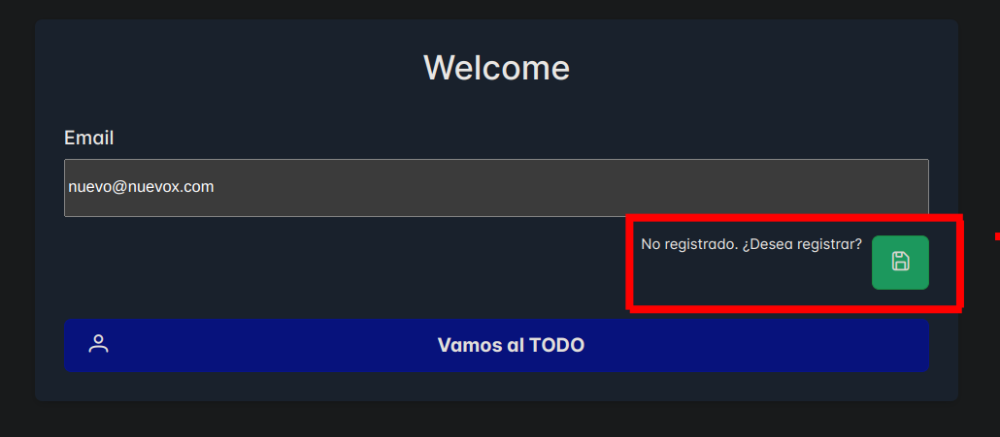

# TodoApp

Este proyecto fue generado con [Angular CLI](https://github.com/angular/angular-cli) versión 18.2.6.

## Paquetes Utilizados
Este proyecto utiliza los siguientes paquetes:

Angular: Versión 18.2.6
PrimeNG: Biblioteca de componentes de UI
PrimeIcons: Conjunto de iconos para PrimeNG
PrimeFlex: Biblioteca de utilidades CSS para PrimeNG

## Descripción

TodoApp es una aplicación de gestión de tareas construida con Angular. Utiliza la biblioteca de componentes [PrimeNG](https://www.primefaces.org/primeng/) para una interfaz de usuario rica y funcional.

## Requisitos

- Node.js
- Angular CLI

## Instalación

1. Clona el repositorio:
    ```sh
    git clone <URL_DEL_REPOSITORIO>
    ```
2. Navega al directorio del proyecto:
    ```sh
    cd todo-app
    ```
3. Instala las dependencias:
    ```sh
    npm install
    ```

## Servidor de desarrollo

Ejecuta `ng serve` para un servidor de desarrollo. Navega a `http://localhost:4200/`. La aplicación se recargará automáticamente si cambias alguno de los archivos fuente.

```sh
ng serve
```

# App:
Si eres un nuevo usuario te saldra esta pantalla despues de escribir tu emial

Aprita el boton que sale debajo de el emial

